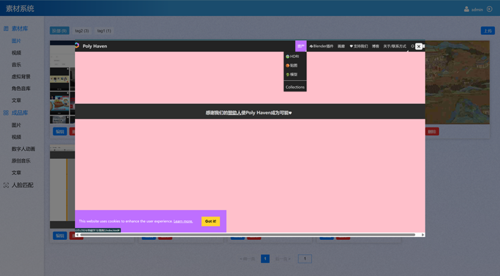
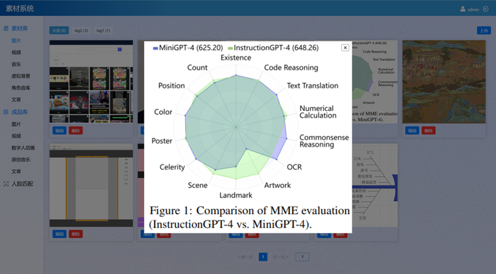
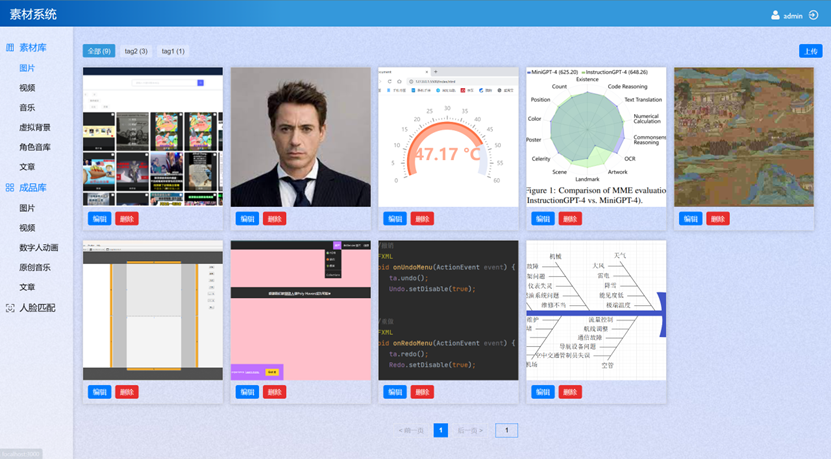
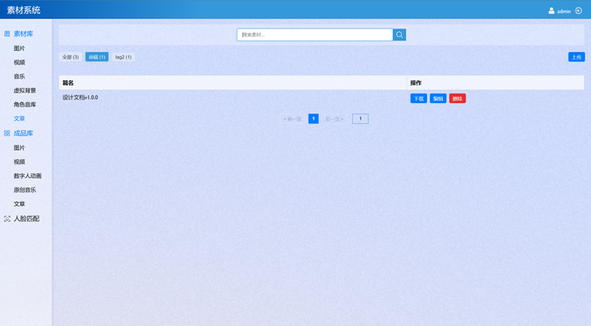
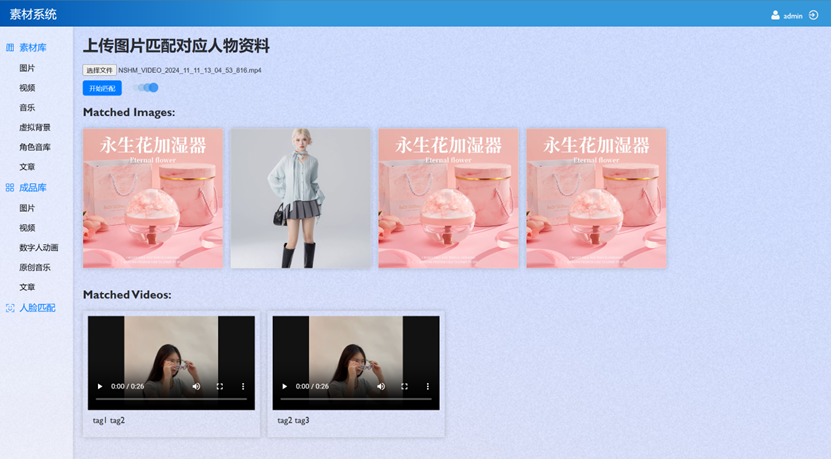
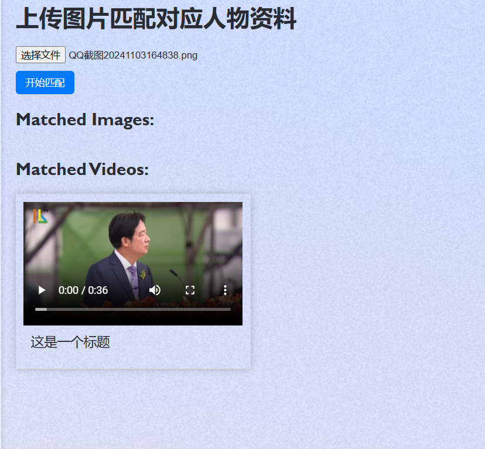

# Material Library Admin App

This is a React application developed for a specific department of the Public Security Bureau (PSB) to manage material documents and products.

## Overview

The application is divided into five main sections: images, documents, audio, video, and digital human matching. It provides a user-friendly interface for viewing, downloading, and searching files, with additional editing, deleting, and uploading capabilities for admin users.<br /><br />

## Features

### User Interface
- **Sidebar Navigation**: The application uses a sidebar to control routing, providing easy access to different sections.
- **Responsive Design**: The layout is responsive, But it does not provide user-friendly access for particularly small screens or mobile devices.
- **Search Functionality**: A search box allows for title-based fuzzy matching, and tags are used for categorization.
- **Viewing**:
 - The image viewing is set up as a detail tab, centrally displayed and uniformly occupying 70vh of the viewport height, with the width set to be responsive, and if it exceeds, it will be displayed with a scroll.<br /><br />
 
 
 - For document viewing, an iframe tab was initially coded, but later it was realized that all documents are .word files (which are not viewable on the web, perhaps you need to find another API), so this part was not enabled.
 - The audio section attempted to use a visualization API, but the results were not satisfactory, so it was not enabled.
 - In addition, considering the large size of the dataset, a simple front-end pagination was implemented.
- **Downloading**: Considering the browser's permission restrictions, a simple download API was written here, including transmission header configuration and simple pipe transmission. If there are any issues with file system access permissions, please add the corresponding code to solve them.

### Admin Capabilities
- **Uploading**: The application uses multer to handle file uploads, saving files to the local dataset and updating the database accordingly.
- **Editing**: Admins can edit file metadata in the database.
- **Deleting**: Admins can delete files, this includes two types: deleting only database information and deleting source files together.




### Digital Human Matching
The application includes a face matching feature, which is currently disabled due to performance issues.(The internal network only has CPU, which results in slow matching speed.)<br />
I will briefly describe the logic of this section:
- **Preparation work**: 
 1. You may need to create a digital human anchor detail image file corresponding to the video file, which stores the front face information of the digital human anchor for face matching. You can write this information into the digital human video table in the database.
 2. Find an API that matches a person's face, compare the likelihood of two images being the same person, and the higher the score returned, the higher the matching degree
- **Backend development**:<br />
 Traverse the paths in different tables, call the matching function to match the images in req, if the score is greater than the specified threshold, count it, and finally SELECT * FROM? WHERE id = ? Return the successfully matched video or image information to the front-end.<br />
 - Back-end interface belike:
 ```
 const imageResponse = await fetch('/api/match-image', {
        method: 'POST',
        body: formData,
      });
 const videoResponse = await fetch('/api/match-video', {
        method: 'POST',
        body: formData,
      });
 ```
 - main function belike:
 ```
 for (const table of tables) {
    const matchedItems = await matchApi(imagePath, table);
    for (const item of matchedItems) {
      if (item.score > threshold) {
        const data = await getDataFromDb(item.id, table);
        results.push(data);
      }
    }
  }
 async function matchApi(imagePath, tableName) {
   // Call the facial recognition API here
   // Assuming that the matchAPI returns an object array containing ID and score
   return new Promise((resolve) => {
     setTimeout(() => {
       resolve([
         { id: 1, score: 0.9 },
         { id: 2, score: 0.4 },
         // ...
       ]);
     }, 500); // 模拟0.5秒的匹配时间
   });
 }
 //This call returns information from the database
 async function getDataFromDb(id, tableName) {
   return new Promise((resolve, reject) => {
     connection.query('SELECT * FROM ? WHERE id = ?', [tableName, id], (error, results) => {
       if (error) reject(error);
       resolve(results[0]); 
     });
   });
 }
 ```


## Future Improvements
- **Word Document Display**: The application will be optimized to display Word documents.
- **Audio Visualization**: Improvements will be made to the audio visualization feature.
- **Enhancing Mobile Responsiveness**: Considering adding a layout that is optimized for mobile devices and smaller screens, ensuring that the application is accessible and user-friendly across all devices.

## Getting Started

### Prerequisites

- Node.js 20.17.0
- MySQL 8.0.39
- npm

### Installation

1. Clone the repository.
2. Create a `.env` file based on the `.env.example` file with your own configuration.
3. This system is designed to operate using the local file system, without relying on a database server proxy. All document operations, including viewing, uploading, and deleting files, are handled directly on the local hard drive. We have implemented a static file storage solution using multer, a middleware for handling multipart/form-data in Node.js applications, which is particularly suited for file uploads.<br />
- **Setting Up the Local Dataset Directory Structure**<br />
  Before you begin, ensure that you have created a parent directory named **dataset** on your local machine. Within this directory, you will create several subdirectories to organize different types of files, such as documents, videos, and images.

>dataset<br />
├── mdocuments<br />
├── mvideo<br />
├── mmusic<br />
├── mimages<br />
├── mbackground<br />
├── msound<br />
├── pdocument<br />
├── pdigital<br />
├── pimages<br />
├── pmusic<br />
└── pvideo<br />
- **Configuring the config.js File**<br />
  To manage the paths for your dataset, you can use the following config.js file. This file allows you to easily change the base directory (baseDir) and the corresponding subdirectories for different file types. **Make sure that the baseDir ends with /dataset to maintain consistency.**
  - **baseDir**: This is the path to the parent directory named dataset. It should be an absolute path and should end with /dataset. Update this path according to your local setup.
  - **directories**: This object maps the names of different file types to their respective subdirectories within the dataset directory. For example, 'MaterialsDocuments' is mapped to 'mdocuments', which means all document files for materials will be stored in the mdocuments folder.
4. Database Configuration
```
CREATE TABLE `user` (
  `id` int unsigned NOT NULL AUTO_INCREMENT,
  `work_number` varchar(30) NOT NULL UNIQUE,
  `name` varchar(255) NOT NULL,
  `password` varchar(255) NOT NULL,
  `user_type` varchar(50) DEFAULT 'user',
  PRIMARY KEY (`id`)
) ENGINE=InnoDB DEFAULT CHARSET=utf8;

CREATE TABLE material_documents (
    id INT AUTO_INCREMENT PRIMARY KEY,
    title VARCHAR(255) NOT NULL,
    path VARCHAR(255) NOT NULL,
    tag VARCHAR(255)
);
CREATE TABLE product_documents (
    id INT AUTO_INCREMENT PRIMARY KEY,
    title VARCHAR(255) NOT NULL,
    path VARCHAR(255) NOT NULL,
    tag VARCHAR(255)
);
CREATE TABLE material_images (
    id INT AUTO_INCREMENT PRIMARY KEY,
    path VARCHAR(255) NOT NULL,
    tag VARCHAR(255)
);
CREATE TABLE product_images (
    id INT AUTO_INCREMENT PRIMARY KEY,
    path VARCHAR(255) NOT NULL,
    tag VARCHAR(255)
);
CREATE TABLE material_background (
    id INT AUTO_INCREMENT PRIMARY KEY,
    title VARCHAR(255) NOT NULL,
    path VARCHAR(255) NOT NULL,
    tag VARCHAR(255)
);
CREATE TABLE material_music (
    id INT AUTO_INCREMENT PRIMARY KEY,
    title VARCHAR(255) NOT NULL,
    path VARCHAR(255) NOT NULL,
    tag VARCHAR(255)
);
CREATE TABLE material_sound (
    id INT AUTO_INCREMENT PRIMARY KEY,
    title VARCHAR(255) NOT NULL,
    path VARCHAR(255) NOT NULL,
    tag VARCHAR(255)
);
CREATE TABLE product_music (
    id INT AUTO_INCREMENT PRIMARY KEY,
    title VARCHAR(255) NOT NULL,
    path VARCHAR(255) NOT NULL,
    tag VARCHAR(255)
);
CREATE TABLE material_video (
    id INT AUTO_INCREMENT PRIMARY KEY,
    title VARCHAR(255) NOT NULL,
    path VARCHAR(255) NOT NULL,
    tag VARCHAR(255)
);
CREATE TABLE product_video (
    id INT AUTO_INCREMENT PRIMARY KEY,
    title VARCHAR(255) NOT NULL,
    path VARCHAR(255) NOT NULL,
    tag VARCHAR(255)
);
CREATE TABLE product_digitalv (
  id INT AUTO_INCREMENT PRIMARY KEY,
  title VARCHAR(255) NOT NULL,
  path VARCHAR(255) NOT NULL,
  tag VARCHAR(255),
  anchor VARCHAR(30) NOT NULL,
  technique VARCHAR(255) NOT NULL
);
```
5. Install dependencies:

```bash
npm install
npm start
npm run build
